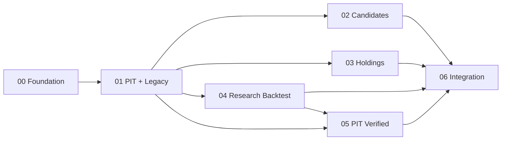

# DA Multi-Agent Execution Implementation Plan

> **For agentic workers:** REQUIRED SUB-SKILL: Use
> superpowers:subagent-driven-development (recommended) or
> superpowers:executing-plans to implement this plan task-by-task. Steps use checkbox
> (`- [ ]`) syntax for tracking.

**Goal:** Coordinate seven implementation plans to deliver the independent DA platform without
cross-agent file conflicts or hidden LA runtime dependencies.

**Architecture:** A coordinator owns shared contracts, migration history, global application wiring,
and final verification. Feature agents work in isolated Git worktrees and own disjoint backend and Web
feature directories. Foundation and PIT contracts land first; candidate, holding, and research backtest
then run in parallel; strict PIT verification and system integration follow.

**Tech Stack:** Git worktrees, Python 3.11, FastAPI, PostgreSQL, SQLAlchemy 2, Alembic, React,
TypeScript, Vite, pytest, Vitest, Playwright

---

## Source of Truth and Dependencies

- Design: `docs/superpowers/specs/2026-07-16-da-hybrid-quant-platform-design.md`
- Strategy copied and frozen during plan 00: `strategies/四维盾剑v2.12.md`
- LA strategy source is used only by plan 01's explicit migration step.

| ID | Plan | Depends on | Parallel group |
| --- | --- | --- | --- |
| 00 | `2026-07-16-00-foundation-contracts.md` | none | foundation |
| 01 | `2026-07-16-01-pit-and-legacy.md` | 00 | data |
| 02 | `2026-07-16-02-candidate-recommendation.md` | 00, 01 | features |
| 03 | `2026-07-16-03-holding-analysis.md` | 00, 01 | features |
| 04 | `2026-07-16-04-backtest-research.md` | 00, 01 | features |
| 05 | `2026-07-16-05-pit-verified-backtest.md` | 01, 04 | strictness |
| 06 | `2026-07-16-06-system-integration.md` | 02, 03, 04, 05 | integration |



## Ownership Rules

| Owner | Writable paths |
| --- | --- |
| Coordinator | root files, `contracts/**`, `backend/app/main.py`, migrations, `web/src/app/**` |
| Plan 01 agent | `backend/app/core/market/**`, PIT adapters, `features/legacy_import/**` |
| Plan 02 agent | `backend/app/features/candidates/**`, `web/src/features/candidates/**` |
| Plan 03 agent | `backend/app/features/holdings/**`, `web/src/features/holdings/**` |
| Plan 04 agent | `backend/app/features/backtests/**`, `web/src/features/backtests/**` |
| Plan 05 agent | strict PIT adapters, audits, and the strict extensions named in plan 05 |
| Plan 06 agent | global wiring, migrations, E2E, deployment, and release documentation |

Every agent prompt enforces these rules:

1. Do not edit outside the assigned plan.
2. Only plans 00 and 06 may edit global entrypoints, migrations, OpenAPI, routing, or global styles.
3. Return a contract-change request instead of editing a frozen shared contract.
4. Never read or import LA at runtime; only plan 01's explicit importer accepts an LA path.
5. Never commit secrets, personal holding notes, raw imports, generated backtest data, or `.env`.
6. Run focused tests before handoff; the coordinator runs the full suite after each integration wave.

## Review Protocol

Every task receives two independent reviews before merge:

1. Spec review against V2.12 and the approved design.
2. Quality review for tests, typing, security, data leakage, and path ownership.

Reject a branch when it lets LLM output create orders, returns future data, parses Markdown as new DA
state, loses result grades/manifests, logs sensitive data, or exposes remote writes without authentication.

### Task 1: Establish the implementation baseline

**Files:**
- Verify: `docs/superpowers/specs/2026-07-16-da-hybrid-quant-platform-design.md`
- Verify:
  - `docs/superpowers/plans/2026-07-16-00-foundation-contracts.md`
  - `docs/superpowers/plans/2026-07-16-01-pit-and-legacy.md`
  - `docs/superpowers/plans/2026-07-16-02-candidate-recommendation.md`
  - `docs/superpowers/plans/2026-07-16-03-holding-analysis.md`
  - `docs/superpowers/plans/2026-07-16-04-backtest-research.md`
  - `docs/superpowers/plans/2026-07-16-05-pit-verified-backtest.md`
  - `docs/superpowers/plans/2026-07-16-06-system-integration.md`

- [ ] **Step 1: Verify planning commits and a clean worktree**

```bash
cd /Users/bujiatang/workspace/DA
git status --short --branch
git log --oneline --decorate -3
```

Expected: the planning branch is clean and the newest commits contain the approved design and plans.

- [ ] **Step 2: Create `main` at the approved planning commit**

The repository started with an unborn `main`, so run once:

```bash
cd /Users/bujiatang/workspace/DA
git branch main HEAD
git switch main
```

Expected: status begins with `## main` and shows no changed files.

- [ ] **Step 3: Create the external worktree parent**

```bash
mkdir -p /Users/bujiatang/workspace/DA-worktrees
git worktree list
```

Expected: the list contains DA on `main`; the external parent needs no DA `.gitignore` entry.

### Task 2: Execute plan 00 alone

**Files:**
- Execute: `docs/superpowers/plans/2026-07-16-00-foundation-contracts.md`

- [ ] **Step 1: Create the foundation worktree**

```bash
cd /Users/bujiatang/workspace/DA
git worktree add /Users/bujiatang/workspace/DA-worktrees/00-foundation -b codex/00-foundation main
```

- [ ] **Step 2: Dispatch one implementation agent**

Use `superpowers:subagent-driven-development`. Give it plan 00, the design, and the ownership rules.
Require checkbox tracking, focused commits, spec review, quality review, and final verification.

- [ ] **Step 3: Verify and fast-forward into main**

Run all plan 00 verification commands, then:

```bash
cd /Users/bujiatang/workspace/DA
git merge --ff-only codex/00-foundation
```

Expected: foundation tests pass and main advances without a merge commit.

### Task 3: Execute plan 01 and freeze data contracts

**Files:**
- Execute: `docs/superpowers/plans/2026-07-16-01-pit-and-legacy.md`

- [ ] **Step 1: Create the PIT worktree**

```bash
cd /Users/bujiatang/workspace/DA
git worktree add /Users/bujiatang/workspace/DA-worktrees/01-pit-legacy -b codex/01-pit-legacy main
```

- [ ] **Step 2: Dispatch and review the plan 01 agent**

Require proof that missing LA does not break normal DA tests and that legacy import is read-only,
explicit, checksummed, idempotent, and tagged as opening balance.

- [ ] **Step 3: Verify and merge plan 01**

```bash
cd /Users/bujiatang/workspace/DA
git merge --ff-only codex/01-pit-legacy
```

Expected: PIT interfaces and legacy import land before feature branches are created.

### Task 4: Run plans 02, 03, and 04 in parallel

**Files:**
- Execute: `docs/superpowers/plans/2026-07-16-02-candidate-recommendation.md`
- Execute: `docs/superpowers/plans/2026-07-16-03-holding-analysis.md`
- Execute: `docs/superpowers/plans/2026-07-16-04-backtest-research.md`

- [ ] **Step 1: Create three worktrees from the same main commit**

```bash
cd /Users/bujiatang/workspace/DA
git worktree add /Users/bujiatang/workspace/DA-worktrees/02-candidates -b codex/02-candidates main
git worktree add /Users/bujiatang/workspace/DA-worktrees/03-holdings -b codex/03-holdings main
git worktree add /Users/bujiatang/workspace/DA-worktrees/04-backtest -b codex/04-backtest-research main
```

Expected: all three branches point to the same commit and own disjoint feature directories.

- [ ] **Step 2: Dispatch exactly three feature agents concurrently**

The coordinator stays on main. Each prompt includes only its feature plan, the design, frozen contracts,
and the ownership rules. The coordinator answers contract questions without editing feature worktrees.

- [ ] **Step 3: Review each feature independently**

Run focused verification and two-stage review. Expected: no branch changes global entrypoints, migrations,
generated OpenAPI, global routing, or another feature directory.

- [ ] **Step 4: Merge feature branches in fixed order**

```bash
cd /Users/bujiatang/workspace/DA
git merge --no-ff codex/02-candidates -m "feat: integrate deterministic candidate recommendations"
git merge --no-ff codex/03-holdings -m "feat: integrate auditable holding analysis"
git merge --no-ff codex/04-backtest-research -m "feat: integrate research-grade backtesting"
```

Expected: feature-local code lands; plan 06 still owns global wiring and migrations.

### Task 5: Run strict PIT verification

**Files:**
- Execute: `docs/superpowers/plans/2026-07-16-05-pit-verified-backtest.md`

- [ ] **Step 1: Create and dispatch the strict worktree**

```bash
cd /Users/bujiatang/workspace/DA
git worktree add /Users/bujiatang/workspace/DA-worktrees/05-pit -b codex/05-pit-verified main
```

The implementation agent completes plan 05. A separate reviewer runs poison-pill fixtures and confirms
that only fully audited runs can receive `data_grade=pit_verified`.

- [ ] **Step 2: Verify and merge strict PIT**

```bash
cd /Users/bujiatang/workspace/DA
git merge --no-ff codex/05-pit-verified -m "feat: verify point-in-time backtests"
```

Expected: research runs remain `research`; historical LLM outputs remain `reconstructed`.

### Task 6: Run final system integration

**Files:**
- Execute: `docs/superpowers/plans/2026-07-16-06-system-integration.md`

- [ ] **Step 1: Create and dispatch the integration worktree**

```bash
cd /Users/bujiatang/workspace/DA
git worktree add /Users/bujiatang/workspace/DA-worktrees/06-integration -b codex/06-integration main
```

Only this agent may now edit global routers, Alembic history, generated OpenAPI, navigation, deployment,
and cross-feature E2E tests.

- [ ] **Step 2: Run the complete release gate**

Run every backend, PostgreSQL, OpenAPI, Web, Playwright, security, and LA-independence command from plan
06. Expected: all commands pass and generated-file checks leave the worktree clean.

- [ ] **Step 3: Merge integration**

```bash
cd /Users/bujiatang/workspace/DA
git merge --no-ff codex/06-integration -m "feat: complete DA analysis platform integration"
```

### Task 7: Close safely

**Files:**
- Verify: `backend/`, `web/`, `contracts/`, `strategies/`, `migrations/`, `.github/`

- [ ] **Step 1: Use the finishing-development-branch workflow**

Invoke `superpowers:finishing-a-development-branch`. Do not push, publish, or delete branches without
explicit user direction.

- [ ] **Step 2: Preserve audit evidence and report honestly**

Verify manifests, test reports, OpenAPI, migrations, and legacy quality reports are available while raw
personal data and secrets remain ignored. Report functions, tests, data limitations, `data_grade`, and
`llm_grade`; do not claim V2.12 passed validation unless plan 05 and sample-out gates actually passed.
