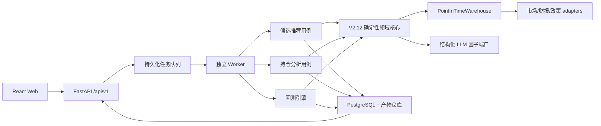

# DA 混合量化分析平台设计规格

> 日期：2026-07-16
>
> 状态：待用户书面确认
>
> 策略基线：`四维盾剑v2.12.md`
>
> 项目边界：DA 是独立项目，运行时不得依赖 LA

## 1. 背景与目标

DA 是面向 A 股研究、模拟和人工决策辅助的新项目。它实现四项用户功能：

1. 候选推荐；
2. 持仓分析；
3. 历史回测；
4. Web 可视化。

系统保留 V2.12 的混合路线：政策文本、技术与相对强度指标、财报数据和 LLM
结构化判断共同形成因子；确定性程序负责股票池、评分、状态机、风险、仓位和成交。
系统不自动提交实盘订单，所有真实交易仍需人工确认。

成功标准不是只提高胜率，而是提供可审计、可重放、能区分研究结果与正式验证结果的
完整闭环，并按 V2.12 的样本外门槛评估净期望和回撤。

## 2. 已确认的边界

### 2.1 DA 独立运行

- DA 拥有独立 Git 仓库、Python 包、前端工程、数据库、配置、密钥和数据目录。
- V2.12 策略原文冻结到 DA 的 `strategies/四维盾剑v2.12.md`，并登记内容哈希；
  DA 不在运行时读取 LA 的策略文件。
- DA 运行、测试、部署和 Web 请求均不得读取 `/Users/bujiatang/workspace/LA`。
- DA 不使用软链接、`PYTHONPATH` 注入或跨项目源码导入复用 LA。
- LA 的代码和数据只能通过显式、一次性的迁移或导入进入 DA。
- DA 的默认启动和 CI 在 LA 不存在时也必须成功。

### 2.2 LA 代码复用方式

允许迁移：

- 纯技术指标函数；
- 市场数据 DTO 和质量规则；
- AkShare、BaoStock、Sina、官方政策和 DeepSeek adapter 的有效逻辑；
- 财报规则、主题映射、持仓成本和执行状态中的纯函数；
- Fake provider 的测试思想。

不直接复制：

- 超过千行且职责混杂的候选推荐和持仓分析 flow；
- 两套相互冲突的日线缓存；
- 依赖 Markdown 反向解析业务状态的链路；
- 当前按股票只数计算行业集中度的规则；
- 现有不可用的回测接口和不完整模拟交易实现。

迁移后的代码归 DA 所有，并按 DA 的端口、领域模型和测试重新组织。迁移清单记录 LA
源文件、源 commit、目标文件、处理方式和 SHA-256，便于后续审计，但不会形成运行依赖。

### 2.3 LA 历史持仓的语义

LA 的当前持仓和历史档案通过显式命令只读导入。导入必须保留原始字节、来源路径、
导入时间、源 Git 状态、SHA-256 和质量标签。

已发现的质量问题包括：索引目标缺失、checksum 不一致、未入索引文件以及快照中的
`buy_date` 晚于快照时间。导入器只报告问题，不自动修改原值。

当前持仓只允许成为：

```text
origin = legacy_opening_balance
```

导入命令必须要求明确的 `effective_at`。系统不虚构历史买入成交，不用这些持仓计算
`effective_at` 之前的策略收益。继承成本仅用于启动日后的盈亏核算。原始历史快照可以
用于低置信度场景查看，但不得计入 V2.12 样本外验收。

## 3. 方案选择

### 3.1 采用：分阶段严格化

第一阶段完成四项产品功能和研究级回测闭环，同时从第一天执行统一的 `as_of_time`
接口、数据血缘、结构化结果和确定性交易规则。第二阶段补齐严格 point-in-time 数据仓库，
通过未来函数审计后将回测升级为正式可验证等级。

选择原因：可以尽早验证产品流程，又不会把当前供应商重建数据包装成可信历史真值。

### 3.2 未采用：严格 PIT 数据仓库先行

优点是第一份回测就有较高可信度；缺点是证券主数据、公司行动、公告修订、政策抓取、
历史行业和交易规则的数据建设周期很长，四项用户功能会较晚形成闭环。

### 3.3 未采用：整体复制 LA 后快速修改

优点是短期页面和流程出现得快；缺点是会继承巨型 flow、双缓存、Markdown 反向解析、
同步任务、内存进度和不可用回测。该方案与 DA 独立且可验证的目标冲突。

## 4. 可信度模型

回测结果同时记录两个互不替代的等级。

### 4.1 数据等级 `data_grade`

| 等级 | 含义 | 允许用途 |
| --- | --- | --- |
| `research` | 使用供应商当前重建的历史数据，可能缺少历史状态或修订版本 | 工程验证、参数探索 |
| `pit_verified` | 所有输入满足 `available_at <= as_of_time`，并通过未来函数审计 | 样本外策略比较 |

`research` 结果必须在 Web、API 和导出报告中显示醒目标识，不能用于宣称 V2.12 已通过
正式历史验证。

### 4.2 LLM 等级 `llm_grade`

| 等级 | 含义 |
| --- | --- |
| `not_used` | 对照组未使用 LLM 文本因子 |
| `reconstructed` | 当前固定模型对历史时点材料进行受限重建 |
| `forward_observed` | 在真实时间到达后即时生成并冻结的 LLM 因子 |

即使 `data_grade=pit_verified`，历史 LLM 仍可能是 `reconstructed`。只有从 V2.12 启用日
开始采集的因子可以标记为 `forward_observed`。系统按这两个维度分别展示结果，避免把
数据无未来函数等同于消除了模型训练知识泄漏。

严格模式遇到缺失或越界材料时失败关闭，不使用中性值偷偷补齐。研究模式允许使用明确
配置的代理数据，但必须记录降级原因，且结果保持 `research`。

## 5. 总体架构

DA 采用“共享深模块 + 功能垂直切片”。共享模块隐藏时点数据、组合账本、LLM 审计和
持久化复杂度；候选、持仓和回测分别拥有应用用例、API、Web 页面和测试。



关键原则：

- 用例返回结构化对象，Markdown 和 Web 都只是投影；
- 所有外部读取显式接收 `as_of_time`；
- 所有策略结果绑定策略版本、数据版本和输入 manifest；
- LLM 不生成交易动作；
- 风险卖出优先于新增风险；
- 研究模式与严格模式共用同一策略和成交引擎，只替换数据能力与审计门槛。

## 6. 建议目录边界

```text
DA/
├── backend/
│   ├── app/
│   │   ├── core/
│   │   │   ├── market/
│   │   │   ├── factors/
│   │   │   ├── portfolio/
│   │   │   ├── strategy/
│   │   │   └── advice/
│   │   ├── ports/
│   │   ├── infrastructure/
│   │   │   ├── market/
│   │   │   ├── policy/
│   │   │   ├── llm/
│   │   │   ├── persistence/
│   │   │   └── tasks/
│   │   ├── features/
│   │   │   ├── runs/
│   │   │   ├── candidates/
│   │   │   ├── holdings/
│   │   │   ├── backtests/
│   │   │   └── legacy_import/
│   │   ├── contracts/
│   │   ├── bootstrap/
│   │   └── main.py
│   ├── migrations/
│   └── tests/
├── web/
│   └── src/
│       ├── app/
│       ├── generated/
│       ├── shared/
│       └── features/
│           ├── candidates/
│           ├── holdings/
│           ├── backtests/
│           └── runs/
├── contracts/
│   ├── openapi.json
│   └── examples/
├── strategies/
│   └── 四维盾剑v2.12.md
├── data/
│   └── imports/
├── docs/
└── tools/
```

职责规则：

- `core` 只放确定性领域逻辑，不导入 FastAPI、SQLAlchemy 或供应商 SDK；
- `ports` 定义窄接口，每个接口只服务一类数据或能力；
- `infrastructure` 实现外部数据、数据库、文件和 LLM adapter；
- `features` 编排用例并暴露自己的 router，不直接修改全局应用入口；
- `contracts/openapi.json` 从 FastAPI 导出并用于生成 TypeScript 客户端；
- Web 不手写后端 DTO，避免 Python 与 TypeScript 契约漂移。

## 7. 共享领域核心

### 7.1 时点数据仓库

对策略暴露单一深接口：

```text
PointInTimeWarehouse.snapshot(as_of_time, scope) -> PointInTimeSnapshot
```

快照包含：

- 当时有效的证券主数据、上市状态、ST、停牌和涨跌幅规则；
- 未复权成交行情、独立复权因子、指数行情和交易日历；
- 当时有效的行业和主题成员关系；
- 财报实际公告、修订版本和结构化财务事实；
- 政策发布时间、首次抓取时间、内容哈希和证据等级；
- 已冻结的 LLM 因子及其输入、输出和模型 manifest；
- 每个字段的来源、版本、`observed_at` 和 `available_at`。

严格模式下，仓库是检查未来函数的唯一出口。adapter 不能绕过仓库直接向策略提供数据。

### 7.2 V2.12 因子与状态机

确定性核心实现：

- 市场状态、两日确认、过热和系统性风险覆盖；
- 股票池硬过滤；
- P、F、R、T、V、S 和横截面排名；
- 核心账本与波段账本准入；
- 突破、回踩、转强、待执行和过期状态机；
- 0.5% 单笔风险预算、100 股取整、5000 元下限；
- 个股、行业、主题、账本、总仓位和 3% 组合风险上限；
- 加仓一次限制、分类冻结、止损只升不降；
- V2.12 卖出优先级和动态替换条件。

所有决定输出稳定原因码，而不只保存中文描述。例如：

```text
MARKET_WEAK
FINANCIAL_RED_FLAG
BREAKOUT_NOT_CONFIRMED
ORDER_BELOW_MIN_NOTIONAL
PORTFOLIO_RISK_LIMIT
BUY_GAP_OVER_3_PERCENT
```

### 7.3 LLM 结构化因子

LLM 输入只包含在 `as_of_time` 已公开的材料及其来源。输出符合 V2.12 JSON 契约，程序
外层重写并校验 `model_id`、`prompt_hash`、`input_hash` 和完整度。

无效条件包括：JSON 无法解析、枚举或范围错误、证据为空、引用不存在、哈希不匹配、
证据发布时间越界。无效 LLM 结果禁止开仓，但价格止损和既有持仓风险规则继续执行。

LLM 原始输入可能含敏感或大段材料，不进入普通日志。数据库和产物保存内容哈希，受控
产物仓库保存原文。日志只记录 run id、hash、状态和错误码，不记录密钥或个人持仓详情。

### 7.4 组合账本和成交模型

`PortfolioLedger` 使用事件和 lot 保存现金、持仓、可卖数量、费用、策略分类、初始风险、
有效止损和最高收盘价。加仓不重置最高价，减仓不改变剩余平均成本。

`ExecutionSimulator` 固定事件顺序：

```text
盘前风险检查
→ T+1 开盘订单尝试
→ 日内硬止损检查
→ 收盘估值
→ 盘后因子与信号
→ 生成下一交易日订单意图
```

模拟必须处理 T+1、停牌、一字板、不同板块涨跌幅限制、开盘高开取消、成交量参与率、
历史费率、滑点、最低佣金、尾仓和未成交原因。成交使用未复权价；指标使用具有明确版本
的调整序列。

## 8. 四项产品功能

### 8.1 候选推荐

输入包括 `as_of_time`、账户/组合状态、策略版本和运行模式。流程为：

1. 获取市场状态和当时可交易股票池；
2. 执行硬过滤；
3. 读取或生成政策、财报结构化因子；
4. 计算 P、F、R、T、V、S 和横截面排名；
5. 更新突破—回踩—转强状态；
6. 结合组合约束计算可执行的计划数量；
7. 保存候选、观察、排除、原因码、证据和质量状态。

结果分为 `executable`、`watchlist` 和 `excluded`，每项都包含触发条件、失效条件、数据
质量和因子明细。政策源全部失败或 LLM 无效时，不产生 `executable` 个股候选。

### 8.2 持仓分析

输入来自 DA 的组合账本，包括 legacy opening balance 和 DA 启动后的真实记录或模拟成交。
流程为：

1. 构建持仓时点行情与数据质量快照；
2. 更新 P、F、R、T、V、S、市场状态和风险敞口；
3. 按优先级检查红灯、硬止损、组合降仓、账本退出和排名衰减；
4. 检查分类冻结、加仓次数、1R、有效止损和 T+1 可卖数量；
5. 输出确定性的建议动作、计划数量、原因码和不可成交风险；
6. 保存结构化结果和 Markdown 报告。

建议动作不自动提交实盘。用户记录真实成交后，系统用真实价格和费用更新账本；未记录则
保持为建议或待人工确认状态。

### 8.3 历史回测

回测请求固定：

- 策略版本和参数集；
- 日期区间、初始资金和研究/严格模式；
- A、B、C、D 对照组；
- 股票池、数据版本、成交模型、滑点和费率版本；
- walk-forward 划分和最终保留样本锁；
- 可选随机种子；默认引擎本身应确定性重放。

`BacktestEngine` 逐交易日调用与实时分析相同的核心和仓库接口，不复制另一套策略公式。
结果包含 V2.12 要求的全部指标、净值和回撤曲线、交易、未成交、风险事件、年度/市场
状态/策略账本分组，以及每个实验组的数据和 LLM 可信度。

若样本外不足 200 笔或其他 V2.12 门槛未满足，系统显示“未通过研究门槛”，不能用空值、
全样本结果或训练样本替代。

### 8.4 Web 可视化

主要导航：

- 总览：数据健康、策略版本、最近运行、组合风险和异常；
- 候选推荐：最新结果、历史运行、候选/观察/排除和证据抽屉；
- 持仓分析：当前持仓、建议动作、风险、因子和历史对比；
- 历史回测：参数表单、运行状态、指标、净值/回撤、交易和审计；
- 运行中心：统一查看任务、错误、产物和输入 manifest。

每个回测页面固定显示 `data_grade` 和 `llm_grade`。研究级结果使用不同颜色和说明，导出
报告也保留标识。大曲线和交易列表采用分页或独立资源，不将所有点塞进运行摘要。

## 9. API 与异步运行契约

首版使用 `/api/v1`：

```text
GET  /health/live
GET  /health/ready
GET  /runs
GET  /runs/{run_id}
GET  /runs/{run_id}/artifacts

POST /candidate-recommendations
GET  /candidate-recommendations/latest
GET  /candidate-recommendations/{run_id}

GET  /portfolio/positions
PUT  /portfolio/positions
POST /holding-analyses
GET  /holding-analyses/latest
GET  /holding-analyses/{run_id}

POST /backtests
GET  /backtests/{run_id}
GET  /backtests/{run_id}/equity-curve
GET  /backtests/{run_id}/trades

GET  /strategy-versions
```

任务创建固定返回 `202 Accepted`、`RunRef` 和 `Location`。运行状态为：

```text
queued → running → succeeded | failed | cancelled
```

状态、阶段、进度、心跳和错误持久化到 PostgreSQL。独立 worker 使用数据库队列领取任务，
不依赖进程内字典。领取任务采用行锁和 `SKIP LOCKED`，重复请求使用 idempotency key。
worker 崩溃后的超时任务可以安全重试；产生订单或账本事件的步骤必须幂等。

统一响应契约至少包含：

```text
RunRef(run_id, kind, status, submitted_at, links)
ErrorResponse(code, message, request_id, details)
Page[T](items, next_cursor)
```

时间统一为带时区 ISO 8601，策略时区为 `Asia/Shanghai`。数据库保存带时区时间。API 枚举
使用稳定英文值，中文只用于前端显示。

## 10. 持久化与数据血缘

### 10.1 运行与结果

- `runs`、`run_events`、`run_artifacts`；
- `candidate_results`、`candidate_items`、`candidate_state_events`；
- `holding_analysis_results`、`holding_analysis_items`；
- `backtest_runs`、`backtest_metrics`、`experiment_results`。

### 10.2 时点数据

- `ingest_batches`、`source_artifacts`；
- `security_master_history`、`security_status_daily`；
- `trading_calendar`、`daily_bars_raw`、`index_daily_bars`；
- `corporate_actions`、`adjustment_factors`；
- `industry_membership_history`、`theme_mapping_versions`；
- `financial_disclosures`、`financial_facts`；
- `policy_documents`、`llm_factor_runs`、`factor_snapshots`；
- `strategy_versions`、`strategy_input_manifests`。

### 10.3 组合与执行

- `portfolios`、`position_lots`、`portfolio_snapshots`；
- `order_intents`、`execution_attempts`、`fills`；
- `risk_events`、`fee_schedules`、`trading_rule_versions`。

### 10.4 Legacy 导入

- `legacy_import_batches`、`legacy_raw_files`；
- `legacy_position_snapshots`、`legacy_trade_events`；
- `opening_positions`。

原始导入文件位于 `data/imports/<batch_id>/raw/`，默认不提交 Git。数据库 manifest 保存相对
路径和 hash。导入器绝不写 LA，重复导入相同 hash 时保持幂等。

## 11. 降级与错误处理

| 异常 | 候选/新开仓 | 既有持仓 | 回测严格模式 |
| --- | --- | --- | --- |
| LLM 无效 | 禁止 | 价格规则继续 | 使用该因子的实验组失败 |
| 政策源全部失败 | 禁止个股新仓 | 旧分按 V2.12 衰减 | 不允许静默补齐 |
| 财报关键字段缺失 | 黄灯并封顶 | 价格规则优先 | 记录缺失；模板不足则禁开仓 |
| 行业指数缺失 | R 降置信度 | 禁止因缺失加仓 | 使用预定义替代并记录 |
| 市场宽度缺失 | 不新增风险 | 使用仓位下限 | 未配置替代则运行失败 |
| 行情日期不一致 | 禁止 | 不生成虚假成交 | 运行失败 |
| 一字板/停牌/量不足 | 记录未成交 | 保留退出意图 | 记录执行尝试和原因 |
| worker 中断 | 不生成部分成功结果 | 不重复写账本 | 从最后安全检查点重试 |

所有错误返回稳定错误码和 request id。用户可理解信息与内部异常分离。日志不得包含 API
密钥、完整 LLM 原文、个人持仓备注或其他 PII。

## 12. 安全与部署边界

首版是单用户、本地运行产品：

- FastAPI 默认只绑定 `127.0.0.1`；
- CORS 只允许配置中的本地 Vite 或正式前端源；
- 不允许通配 CORS 与 credentials 同时启用；
- SQL 使用 SQLAlchemy 参数化查询，不拼接用户输入；
- 文件产物通过数据库 id 读取，并校验解析后路径位于产物根目录；
- 密钥只从环境或 secret provider 读取，不写入文档、数据库普通字段或日志；
- Web 和 API 一旦配置为非 loopback 监听，启动检查必须要求认证配置，否则拒绝启动。

远程多用户认证、权限角色和公网部署属于后续独立规格。在该规格完成前，DA 不得以无认证
方式监听公网地址。

## 13. 测试策略

### 13.1 后端与领域

- 所有新功能按红—绿—重构编写 pytest；
- 纯因子使用手算 golden tests；
- 每个生产 adapter 和 Fake adapter 运行相同 port contract tests；
- 使用临时 PostgreSQL 验证 repository、迁移、队列锁和幂等；
- 固定行情 fixture 验证策略和成交完全可重放；
- 使用性质测试保证现金、持仓、可卖数量和风险不为负或越界。

### 13.2 未来函数专项测试

- 任意查询结果必须满足 `available_at <= as_of_time`；
- 构造未来财报、政策、行业、ST、退市和复权因子毒丸数据；
- 当前上市名单不得回填历史股票池；
- 未来分红送转不得改变过去已经固化的输入 manifest；
- T 日收盘信号不得在 T 日收盘成交；
- 一字板、停牌和 T+1 不得产生虚假成交；
- 历史 LLM 引用越界或证据不存在时必须拒绝。

严格回测立项门槛是上述测试先通过，而不是先比较收益。

### 13.3 Web 与契约

- FastAPI API 契约测试覆盖成功、降级、认证边界和错误 envelope；
- OpenAPI 导出后生成 TypeScript 客户端，CI 检查生成文件无未提交差异；
- Vitest 与 React Testing Library 覆盖各功能状态和可信度标签；
- Playwright 覆盖“发起任务—观察进度—查看结果—导出报告”的关键路径；
- 固定 `contracts/examples` 允许前端在后端功能未完成时独立开发。

### 13.4 CI 验证顺序

```text
Python lint/format/type check
→ pytest unit
→ PostgreSQL integration tests
→ OpenAPI export and no-diff check
→ frontend install/typecheck/unit tests
→ frontend production build
→ Playwright E2E
```

## 14. 多 Agent 并行设计

项目使用最多四个并发槽位：一个协调/集成 Agent 加三个功能 Agent。实施前为每个 Agent
创建独立 Git worktree 和 `codex/` 分支，禁止多个 Agent 在同一工作树修改文件。

### 14.1 所有权

| Agent | 独占范围 | 禁止修改 |
| --- | --- | --- |
| 协调/集成 | 根配置、`contracts/**`、`main.py`、应用路由、迁移链、全局 Web 壳 | 功能内部实现 |
| 候选推荐 | `features/candidates/**` 和对应 Web、测试 | 全局入口和迁移链 |
| 持仓分析 | `features/holdings/**`、legacy 用例和对应 Web、测试 | 全局入口和迁移链 |
| 历史回测 | `features/backtests/**` 和对应 Web、测试 | 全局入口和迁移链 |

共享 `core`、`ports` 和 `infrastructure` 先由基础设施任务冻结接口。波次 1 内进一步按
`market`、`portfolio`、`tasks` 子目录互斥分配，不能多人修改同一子目录。后续变更以契约
提案交协调 Agent 合入。只有协调 Agent 生成 Alembic 迁移、修改 `down_revision`、导出
OpenAPI、修改前端路由和全局样式。

### 14.2 实施波次

#### 波次 0：基线与契约，协调 Agent 独占

- 初始化 Python、React、PostgreSQL、测试和 CI；
- 固化 V2.12 类型、原因码、时点契约和 OpenAPI 公共 envelope；
- 建立数据库迁移基线、任务队列、worker 接口和 Web 壳；
- 提供 feature router/page 注册接口与契约 fixtures。

该波次完成后才允许三个功能 Agent 并行，避免分别发明公共类型。

#### 波次 1：三个基础能力并行

- 数据 Agent：PIT 仓库接口、research adapter、行情质量和迁移后的 provider；
- 组合 Agent：PortfolioLedger、ExecutionSimulator 基础和 legacy 导入；
- 运行/Web Agent：持久化任务执行、生成客户端、任务中心和页面骨架；
- 协调 Agent：审查接口、一致性和迁移需求，不与子 Agent 修改同一文件。

#### 波次 2：三个垂直功能并行

- 候选 Agent：候选后端用例、结构化 API、页面和 feature tests；
- 持仓 Agent：持仓后端用例、结构化 API、页面和 feature tests；
- 回测 Agent：研究级引擎、A-D 对照、报告、页面和 golden tests；
- 协调 Agent：依次集成 router、迁移和 OpenAPI，运行全量契约测试。

#### 波次 3：严格化与独立审计并行

- PIT Agent：历史证券状态、财报修订、政策版本、复权和行业历史；
- 回测 Agent：walk-forward、保留样本锁、全部指标和压力成交模型；
- QA Agent：未来函数毒丸、确定性重放、性质测试和结果标签审计；
- 协调 Agent：跨模块 E2E、安全检查和性能基线。

#### 波次 4：验收与发布

- 对研究模式和严格模式分别验收；
- 导入一次 LA 当前持仓并审核质量报告；
- 完成从候选到持仓、回测和 Web 的端到端演练；
- 生成版本化发布说明，不宣称未经验证的策略收益。

### 14.3 合并和审查协议

每个任务采用小步 Conventional Commits。功能 Agent 不直接合并自己的分支。协调 Agent
按“契约 → 共享核心 → 功能 → 路由/迁移 → E2E”顺序集成。每个功能必须经过：

1. 需求与策略规格审查；
2. 代码质量和安全审查；
3. 功能测试和全量回归；
4. OpenAPI 和 TypeScript 生成差异检查。

若两个 Agent 需要修改同一共享文件，后到任务停止该修改并提交接口需求，由协调 Agent
统一处理，避免隐式冲突。

## 15. 分项目实施计划

本规格覆盖多个可独立验收的子系统。用户确认后，不生成一个巨型实施计划，而生成以下
相互引用的计划：

1. `00-foundation-contracts`：项目基线、共享契约、任务系统和 Web 壳；
2. `01-pit-and-legacy`：时点仓库接口、research adapters 和 legacy 导入；
3. `02-candidate-recommendation`：候选推荐垂直切片；
4. `03-holding-analysis`：持仓分析垂直切片；
5. `04-backtest-research`：研究级回测、A-D 对照和可视化；
6. `05-pit-verified-backtest`：严格 PIT 数据、walk-forward 和未来函数审计；
7. `06-system-integration`：全链路 E2E、安全、运维和发布验收。

每份计划给出准确文件、测试、命令、预期结果、依赖、目录所有权和提交边界。并行只能发生
在其阻塞依赖已经完成且所有权互斥时。

## 16. 验收标准

### 16.1 独立性

- 删除或重命名 LA 后，DA 安装、测试、启动和四项功能不受影响；
- DA 仓库不存在指向 LA 的软链接、运行导入或默认绝对路径；
- legacy 导入只在用户显式命令中接受 LA 路径，且绝不回写源目录。
- 策略 registry 只读取 DA 内冻结的 V2.12 文件，并验证登记的 SHA-256。

### 16.2 候选与持仓

- 同一策略版本、输入 manifest 和 `as_of_time` 产生完全相同的确定性结果；
- LLM 无效、政策源失败和关键数据缺失均按 V2.12 失败关闭；
- 建议动作全部由规则产生，并带原因码、数据质量和人工确认标识；
- 行业集中度按市值/目标权重计算，不按股票只数计算。

### 16.3 回测

- 研究结果始终显示 `data_grade=research`；
- 严格结果只有通过未来函数测试后才能显示 `pit_verified`；
- A-D 使用相同股票池、市场过滤、费用、滑点和风险预算；
- 实现 T+1、涨跌停、停牌、参与率、历史费率和未成交；
- 报告 V2.12 第十八章全部指标和验收门槛；
- LLM 历史因子始终标记 `reconstructed`，前瞻因子才标记 `forward_observed`。

### 16.4 Web 与运维

- 四项功能可以从 Web 发起或查看，长任务返回 202 且状态跨重启保留；
- 前后端契约由 OpenAPI 生成并由 CI 保持同步；
- 关键路径 E2E 通过；
- 默认只监听 loopback，日志不包含密钥、PII 或完整个人持仓备注；
- PostgreSQL、FastAPI、worker 和 Web 均有明确健康检查与启动顺序。

## 17. 非目标

- 自动实盘交易或券商自动下单；
- 融资融券、期权、期货或高频分钟级策略；
- 在首版构建远程多用户权限系统；
- 把不完整 LA 档案修补成虚构历史成交；
- 为提高回测结果而在保留样本上反复调参；
- 在 PIT 数据没有通过审计前对外宣称策略已经被完整验证。

## 18. 主要风险与控制

| 风险 | 控制 |
| --- | --- |
| 历史股票池和财报修订不可得 | 研究/严格分级，严格模式缺失即失败 |
| 当前模型包含历史训练知识 | LLM 重建标签、匿名标识、前瞻验证 |
| 供应商复权口径不一致 | 未复权成交价与独立复权因子分离并版本化 |
| 多 Agent 修改共享文件 | worktree、独占目录、协调 Agent 单点集成 |
| 大型 flow 再次形成 | 领域核心和垂直用例分层，结构化结果替代 Markdown 状态 |
| 长任务阻塞 API | PostgreSQL 持久化队列与独立 worker |
| 回测参数过拟合 | walk-forward、保留样本锁、版本化参数和 A-D 对照 |
| 历史持仓不完整 | legacy opening balance 语义和质量报告，不反推成交 |

## 19. 最终设计结论

DA 将是独立、模块化的 V2.12 混合量化平台。它复用 LA 已验证的纯逻辑和外部 adapter，
但不复制 LA 的流程耦合与回测缺陷。候选、持仓、回测和 Web 共享同一套结构化领域核心，
并通过持久化任务、OpenAPI 和时点数据仓库形成可重放闭环。

第一阶段交付研究级四功能产品，第二阶段以未来函数审计为门槛升级严格 PIT 回测。任何
结果都同时显示数据等级和 LLM 等级，从制度上避免“能跑”被误解为“已验证有效”。
